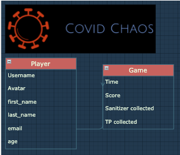

# 🦠 Covid Chaos API 🧟‍♂️
## Contents 
-----------------------------
* Introduction 
* Installation
* Running the local server
    * Stopping the local server
* Routes 

### 👋🏼 Introduction 
-----------------------------
Current Maintainer: Tom Tobar <devtomtobar@gmail.com>

Covid Chaos API was my Mod 3 project at Flatiron School. It was the end of February 2020 when Flatiron School and many other companies sent thier teams to work from home to self isolate. Toilet paper, and other essential items like hand sanitizer, became scarce as well as decency during the uncertain times. I knew I wanted to create a game for the project and thought that it would be a good distraction, to the madness unfolding around me, to tie the theme of the game to the chaos.  This is what I had in mind:
  

  
This is a screen shot of a keynote presentation that I created for the pitch to my instructors. I originally thought that there might be monsters coming from the bottom of the canvas element to attack the player and covid viruses raining from above. The gameplay now has monsters and viruses both rainging from the top of the screen. 
  
The goal of the game is to collect as much hand sanitizer and toilet paper as possible to earn a slot in the Top 5 scores:
 
* TP = 10 points
* Sanitizer = 5 points
* Bonus points: 1 bonus point will be added to overall score after player stays covid free for 30 seconds. 
  
For the Rails backend, I wanted to keep it simple. Here is a wire frame with what I had originally planned:
  

  
I wanted to have a potentially sign up with username and password (and did implement that for the project) but ended up going old school with just an entry of the player name. Here is a look at the user story:
  

  
This game was a labor of love for me and I will constantly make improvements to learn something new from it. 

### 🛠Installation
-----------------------------
* This Rails API was built with a PostgreSQL database and requires ruby-2.6.1 or later
* Clone the repo onto your local machine
    * CD (change directory) into the cloned directory
    * run the following commands: 
    * bundle install
    * rails db:create
    * rails db:migrate
    * rails db:seed

### 🏃🏽‍♀️ Running the local server
-----------------------------
* To run the API on a local server, run the command:
    * rails s -p 3001 (running on port 3001)
* Open Google Chrome and paste this in the URL bar:
    * [http://localhost:3001/players](http://localhost:3001/players)

### 🛑 Stopping the local server
-----------------------------
* To stop a running local server, press:
    * control + c
### 🛣 Routes 
-----------------------------
* The current used routes are:
    * [http://localhost:3001/players](http://localhost:3001/players)
    * [http://localhost:3001/games](http://localhost:3001/games)
    * [http://localhost:3001/top-five](http://localhost:3001/top-five)